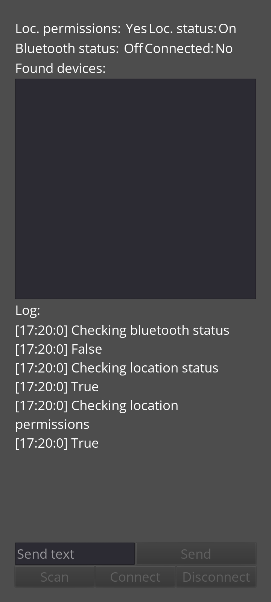
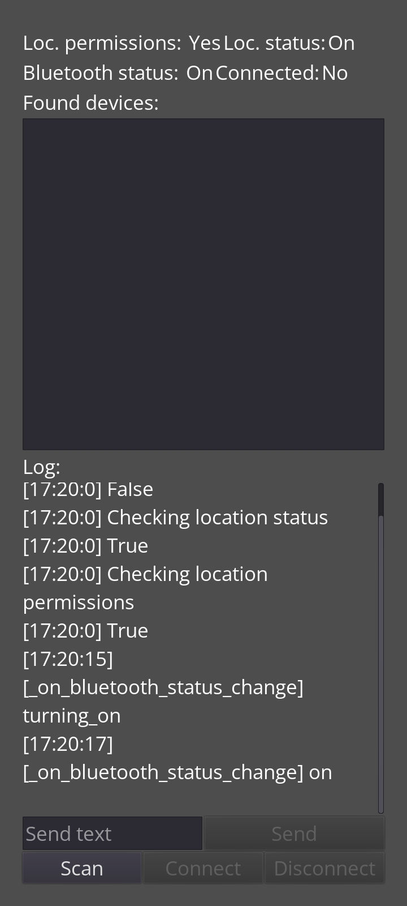
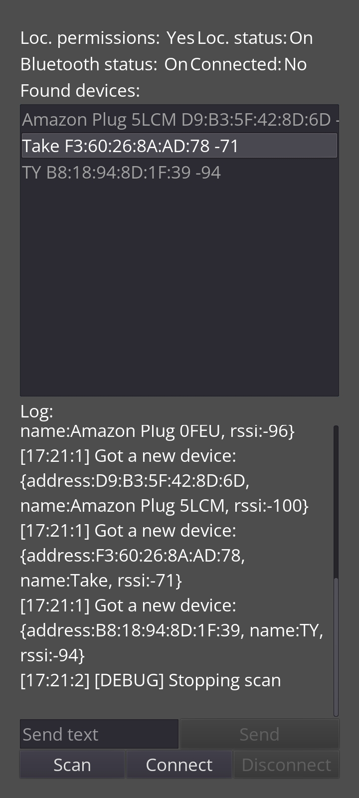
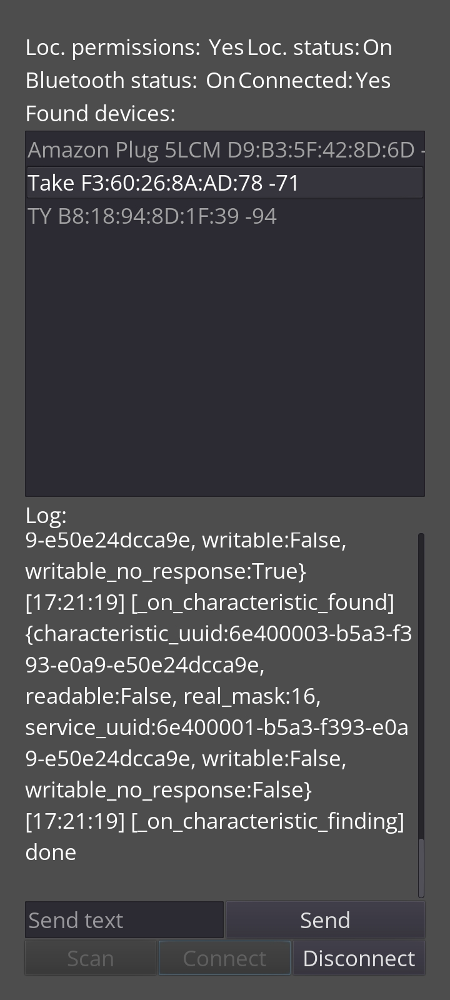
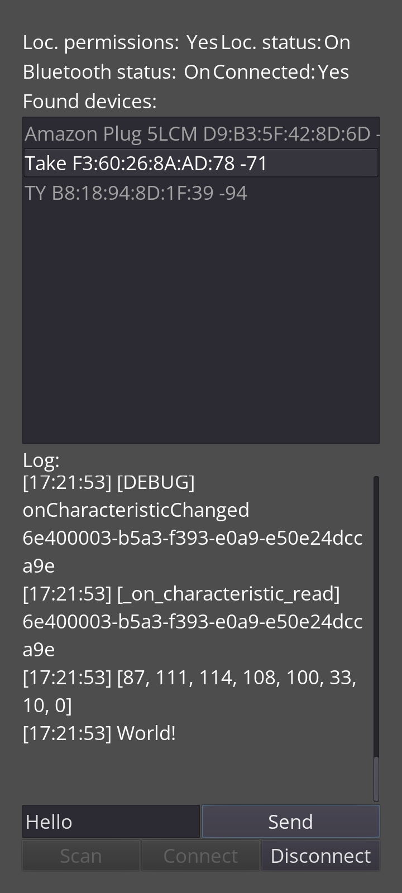
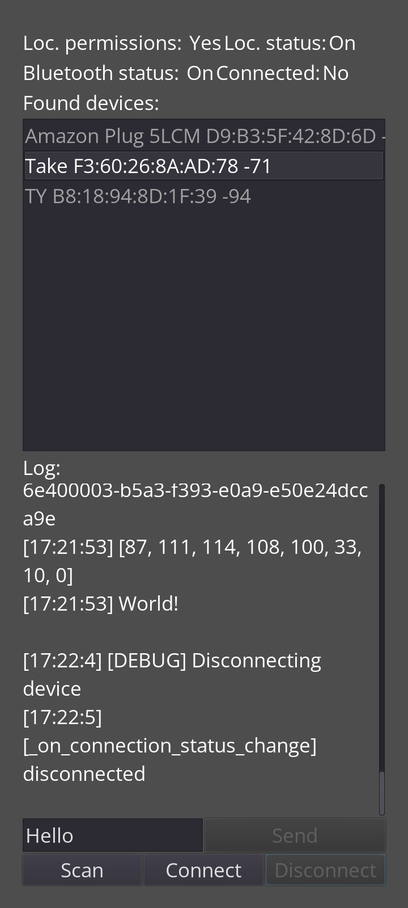

# Godot Android Bluetooth Plugin Demo

This is the Godot project that makes use of the [Godot Android Bluetooth Plugin](https://github.com/pablojimenezmateo/GodotAndroidBluetoothPlugin). Check out the other project (or the sourcecode) to get an overview of the API.

The app has 4 main components:

* The labels at the top: Tell you the current status
* The "Found devices" list, shows found devices
* The Log: Shows information from the Godot app as well as from the Android plugin
* The buttons: Used to control the flow

## Software versions

This versions have been tested:

* Godot: 3.4.4
* Android: 11

## Screenshots

**Bluetooth off**

**Bluetooth on**

**After scanning**

**After connecting**

**After sending text**

**After receiving text**

**After disconnecting**

## License
 
The MIT License (MIT)

Copyright (c) 2015 Chris Kibble

Permission is hereby granted, free of charge, to any person obtaining a copy of this software and associated documentation files (the "Software"), to deal in the Software without restriction, including without limitation the rights to use, copy, modify, merge, publish, distribute, sublicense, and/or sell copies of the Software, and to permit persons to whom the Software is furnished to do so, subject to the following conditions:

The above copyright notice and this permission notice shall be included in all copies or substantial portions of the Software.

THE SOFTWARE IS PROVIDED "AS IS", WITHOUT WARRANTY OF ANY KIND, EXPRESS OR IMPLIED, INCLUDING BUT NOT LIMITED TO THE WARRANTIES OF MERCHANTABILITY, FITNESS FOR A PARTICULAR PURPOSE AND NONINFRINGEMENT. IN NO EVENT SHALL THE AUTHORS OR COPYRIGHT HOLDERS BE LIABLE FOR ANY CLAIM, DAMAGES OR OTHER LIABILITY, WHETHER IN AN ACTION OF CONTRACT, TORT OR OTHERWISE, ARISING FROM, OUT OF OR IN CONNECTION WITH THE SOFTWARE OR THE USE OR OTHER DEALINGS IN THE SOFTWARE.